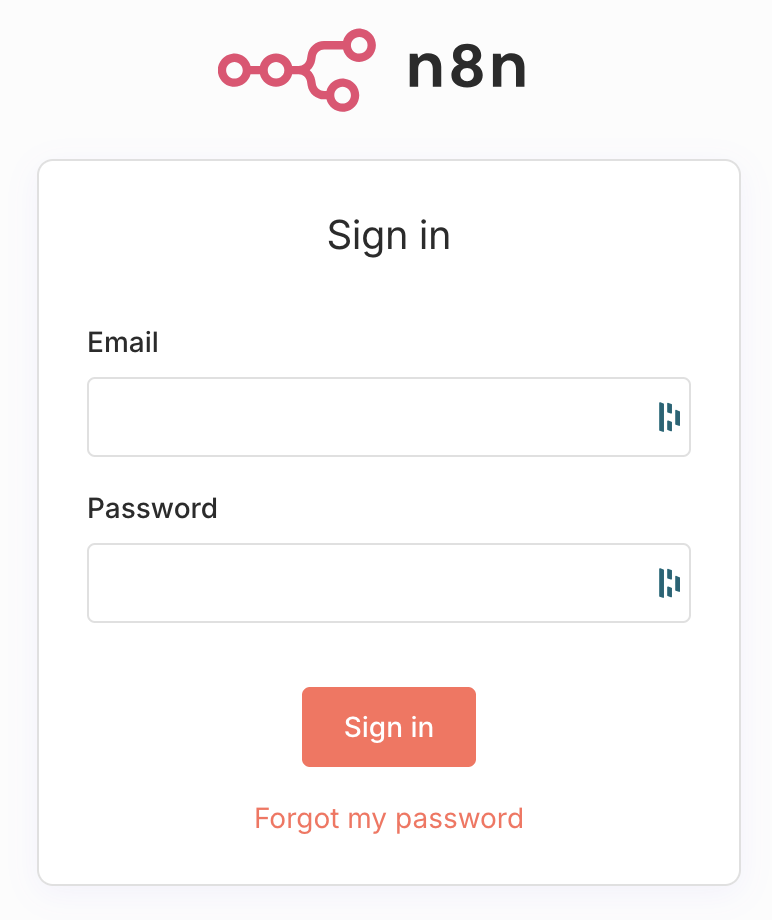
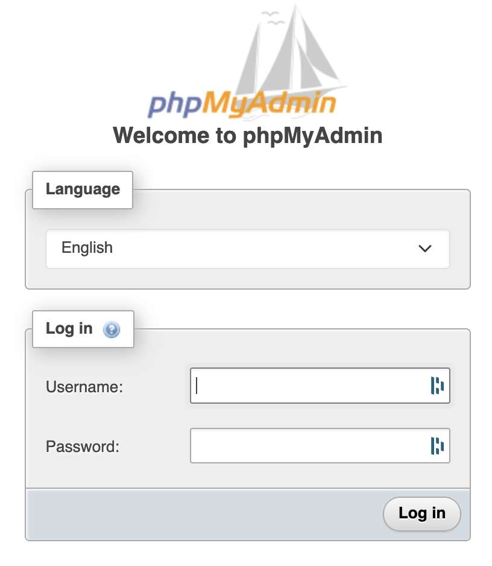
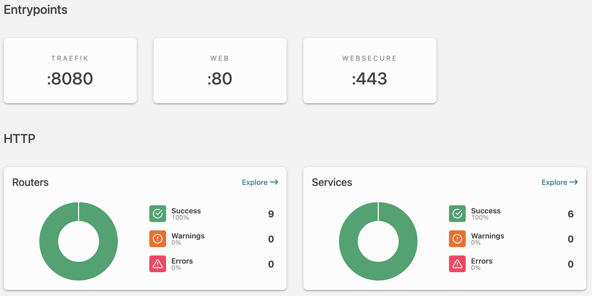

# 01 - Getting Started Guide

**Difficulty Level:** 🟢 Beginner  
**Estimated Time:** 15-20 minutes

---
## 📋 Table of Contents
- [Welcome to your n8n Server](#welcome-to-your-n8n-server)
- [What You Should Have Received](#-what-you-should-have-received)
- [First Steps Overview](#-first-steps-overview)
- [Step 1: Verify Web Access](#step-1-verify-web-access)
  - [1.1 Access n8n](#11-access-n8n)
  - [1.2 Access phpMyAdmin](#12-access-phpmyadmin)
  - [1.3 Access Traefik Dashboard](#13-access-traefik-dashboard)
- [Step 2: First SSH Connection](#step-2-first-ssh-connection)
- [Step 3: Verify all services are running](#step-3-verify-all-services-are-running)
- [Step 4: Understanding your server layout](#step-4-understanding-your-server-layout)
- [Step 5: Initial security steps](#step-5-initial-security-steps)
  - [5.1 Change Default Passwords](#51-change-default-passwords)
  - [5.2 Review Authorized SSH Keys](#52-review-authorized-ssh-keys)
  - [5.3 Check Fail2ban Status](#53-check-fail2ban-status)
- [Step 6: Test Basic Operations](#step-6-test-basic-operations)
  - [6.1 Restart a Container](#61-restart-a-container)
  - [6.2 View Live Logs](#62-view-live-logs)
- [Verification Checklist](#-verification-checklist)


## Welcome to Your n8n Server!

Congratulations! Your n8n self-hosted server is ready. This guide will walk you through your first connection and help you verify everything is working correctly.

## 📦 What You Should Have Received

Before starting, make sure you have:
- ✅ **Credentials PDF** with:
  - Hosting credentials
  - Server IP address and information
  - SSH private key file
  - Email/SMTP credentials
  - Basic Auth credentials
  - n8n admin credentials
  - Database credentials
  - All service URLs
- ✅ **SSH Private Key File** (usually named `id_client_USERNAME` or similar)

> 💡 **TIP:** Keep your credentials PDF and SSH key in a secure location. Consider using a password manager.

---

## 🎯 First Steps Overview

Here's what we'll do in this guide:
1. Verify you can access all web services
2. Make your first SSH connection
3. Check that all services are running
4. Understand your server layout
5. Complete initial security steps

---

## Step 1: Verify Web Access

Let's make sure all your web services are accessible before diving into the command line.

### 1.1 Access n8n

1. Open your web browser
2. Navigate to: `https://n8n.yourdomain.website` You can find this URL in the PDF : SERVICE N8N > n8n URL
3. You should see the n8n login page

**Expected Result:**
- ✅ Page loads with a valid SSL certificate (🔒 padlock icon in browser)
- ✅ n8n login screen is displayed

> ⚠️ **If you see a security warning:** This is not normal, and you should contact me for further investigation. 

**Login to n8n:**
- Use the credentials from your PDF
- You should see the n8n dashboard



---

### 1.2 Access phpMyAdmin

1. Navigate to: `https://phpmy.yourdomain.website` You can find this URL in the PDF : SERVICE PHPMYADMIN > PhpMyAdmin URL
2. You'll be prompted for **Basic Authentication** first:
   - Username: (found in your credentials PDF, Basic Auth Username)
   - Password: (found in your credentials PDF, Basic Auth Password)
3. Then you'll see the phpMyAdmin login: (You can use either n8n or root user)
   - Username: (from credentials PDF)
   - Password: (from credentials PDF)

**Expected Result:**
- ✅ Double authentication works (basic auth + phpMyAdmin login)
- ✅ You can see the n8n database



> ⚠️ **CAUTION:** phpMyAdmin provides direct database access. Be very careful when making changes here.

---

### 1.3 Access Traefik Dashboard

1. Navigate to: `https://traefik.yourdomain.website` You can find this URL in the PDF : SERVICE TRAEFIK > Traefik URL
2. Enter basic authentication credentials (from your PDF)
3. You should see the Traefik dashboard showing your services

**Expected Result:**
- ✅ Dashboard shows HTTP and TCP routers
- ✅ All services show as "green" or healthy



---

## Step 2: First SSH Connection

Now let's connect to your server via SSH. If you haven't set up SSH yet, please refer to [02 - SSH Connection Guide](02-ssh-guide.md) first.

### 2.1 Connect to Your Server

**Using Terminal (Mac/Linux) or PowerShell (Windows):**

```bash
# Navigate to where your SSH key is stored
cd ~/path/to/your/ssh/key

# Set correct permissions (Mac/Linux only)
chmod 600 id_client_USERNAME

# Connect to your server
ssh -i filepath/to/your/private/key -p 1077 USERNAME@YOUR_SERVER_IP
```
> 💡 **TIP:** Your username and server IP can be found in the section SERVER INFORMATION in the credentials PDF.
> 
**Expected Result:**
```
Welcome to Ubuntu 24.04.3 LTS (GNU/Linux 6.8.0-90-generic x86_64)
[...]
```

> 💡 **TIP:** If this is your first connection, you'll be asked to verify the server fingerprint. Type `yes` to continue.

---

### 2.2 First Look Around

Once connected, let's verify your setup:

```bash
# Check your current location
pwd
# Output: /home/USERNAME

# List files in your home directory
ls -la
# You should see a 'docker' folder

# Navigate to the docker folder
cd docker

# See what's inside
ls -la
# You should see: docker-compose.yml, .env file, my.cnf and possibly other config files
```

---

## Step 3: Verify All Services Are Running

Let's check that all Docker containers are up and healthy.

### 3.1 Check Docker Container Status

```bash
# Make sure you're in the docker directory
cd /home/USERNAME/docker

# View running containers
docker compose ps
```

**Expected Output:**
```
NAME                COMMAND                  SERVICE             STATUS              PORTS
db_core   mysql:8.4                 "docker-entrypoint.s…"   db_core   4 days ago   Up 4 days   3306/tcp, 33060/tcp
n8n       docker.n8n.io/n8nio/n8n   "tini -- /docker-ent…"   n8n       4 days ago   Up 4 days   127.0.0.1:5678->5678/tcp
phpmy     phpmyadmin:5.2            "/docker-entrypoint.…"   phpmy     4 days ago   Up 4 days   80/tcp
traefik   traefik                   "/entrypoint.sh --ap…"   traefik   4 days ago   Up 4 days   0.0.0.0:80->80/tcp, 0.0.0.0:443->443/tcp
```

> ✅ **All containers should show "Up"** - If any show "Restarting" or "Exited", see [11 - Troubleshooting Guide](11-troubleshooting.md)

---

### 3.2 Quick Health Check

```bash
# Check Docker logs for errors (last 20 lines of each service)
docker compose logs --tail=20 n8n
docker compose logs --tail=20 db_core
docker compose logs --tail=20 traefik

# Check disk space
df -h
# Make sure you have at least 20% free space on your main partition (/dev/vda1)
```
**Expected Output**
```
Filesystem      Size  Used Avail Use% Mounted on
tmpfs           197M  1.1M  196M   1% /run
/dev/vda1        19G  6.3G   12G  35% /             <= Should be less than 80%
tmpfs           984M     0  984M   0% /dev/shm
tmpfs           5.0M     0  5.0M   0% /run/lock
tmpfs           197M  8.0K  197M   1% /run/user/1000
```

**What to look for in logs:**
- ✅ No red ERROR messages
- ✅ n8n should show "Editor is now accessible via: http://..."
- ✅ db_core (MySQL) should show "ready for connections"

---

## Step 4: Understanding Your Server Layout

Here's how your server is organized:

```
/home/USERNAME/
└── docker/                         # Main Docker setup folder
   ├── docker-compose.yml           # Defines all services
   ├── .env                         # Environment variables & secrets
   └── my.cnf                       # MySQL custom configuration file

```

**Important Files:**
- `docker-compose.yml` - Defines what containers run and how
- `.env` - Contains passwords, domain names, and configuration

**Where is your data stored?**

Your actual data (n8n workflows, database, etc.) is stored in **Docker named volumes**, not in regular folders. These are managed by Docker itself.

```bash
# View all Docker volumes
docker volume ls

# You should see volumes like:
DRIVER    VOLUME NAME
local     docker_mysql_data
local     docker_n8n_data
local     docker_n8n_files
local     docker_traefik_letsencrypt
```

**To inspect a volume's location:**
```bash
# See where Docker stores a specific volume
docker volume inspect docker_n8n_data

# This will show something like:
"Mountpoint": "/var/lib/docker/volumes/docker_n8n_data/_data"
```

> ⚠️ **IMPORTANT:** Do NOT manually edit files in `/var/lib/docker/volumes/` - always use Docker commands to manage volumes.

> 💾 **BACKUP NOTE:** To backup your data, you'll need to backup the Docker volumes, not regular folders. See [06 - Backup & Recovery](06-backup-recovery.md) for the proper procedure.

**Quick volume commands you'll need:**
```bash
# List all volumes
docker volume ls

# See volume details (including size and location)
docker volume inspect VOLUME_NAME

# DANGEROUS: Remove unused volumes (will ask for confirmation)
docker volume prune
```
### Database Configuration
- **Default:** n8n uses SQLite (file-based, no MySQL needed)
- **Optional:** To use MySQL instead, uncomment (remove #) the MySQL section in docker-compose.yml:
```
# DB_TYPE: mysqldb
# DB_MYSQLDB_HOST: db_core
# DB_MYSQLDB_PORT: 3306
# DB_MYSQLDB_DATABASE: ${MYSQL_DATABASE}
# DB_MYSQLDB_USER: ${MYSQL_USER}
# DB_MYSQLDB_PASSWORD: ${MYSQL_USER_PWD}

-> And comment the SQLITE parameter adding a # at the begining of the line.
DB_SQLITE_POOL_SIZE: 3
```

---

## Step 5: Initial Security Steps

Now that you're connected, let's complete some important security tasks.

### 5.1 Change Default Passwords

It's good practice to change the passwords from the defaults provided **if and only if** you are not in fully managed mode. Otherwise, you're literally shutting me off your server administration:

**Change n8n Admin Password:**
1. Log into n8n web interface
2. Click your profile (bottom left)
3. Go to Settings → Personal → Change password
4. Update your password manager

**Change MySQL Root Password (Optional but recommended):**
```bash
# Connect to MySQL container
docker compose exec db_core mysql -u root -p
# Enter current root password from the PDF file

# Change password
ALTER USER 'root'@'localhost' IDENTIFIED BY 'your-new-strong-password';
ALTER USER 'root'@'%' IDENTIFIED BY 'your-new-strong-password';
FLUSH PRIVILEGES;
EXIT;

# Update the .env file with new password
nano .env
# Find MYSQL_ROOT_PWD and update it
# Press CTRL+X, then Y, then ENTER to save

# Restart containers to apply new password
cd ~/docker
docker compose down
docker compose up -d

# Verify n8n can connect (if n8n is configured as using MySQL as a DBengine.
docker compose logs n8n | grep -i "database\|mysql"
```


### 5.2 Review Authorized SSH Keys

Let's see who has access to your server:

```bash
# View authorized SSH keys (in USERNAME account)
cat ~/.ssh/authorized_keys

# View authorized SSH keys (in root account)
sudo cat /root/.ssh/authorized_keys
```

You should see:
- Your SSH public key corresponding to the SSH secret key I gave you.

> 💡 **TIP:** If you want to remove my access immediately, see [03 - Security & Access Management](03-security-access.md)

---

### 5.3 Check Fail2ban Status

Fail2ban is protecting your server from brute force attacks:

```bash
# Check if fail2ban is running
sudo systemctl status fail2ban
```
**Expected Output:**
```bash
● fail2ban.service - Fail2Ban Service
     Loaded: loaded (/usr/lib/systemd/system/fail2ban.service; enabled; preset: enabled)
     Active: active (running) since Tue 2025-12-23 05:12:39 CET; 5 days ago
```
```bash
# View current jails (protection rules)
sudo fail2ban-client status
```

**Expected Output:**
```bash
Status
|- Number of jail:	3
`- Jail list:	port-scan, ssh-username-scan, sshd
```

> ✅ All jails should be active. If you ever lock yourself out, see [03 - Security & Access Management](03-security-access.md)

---

## Step 6: Test Basic Operations

Let's make sure you can perform basic management tasks.

### 6.1 Restart a Container

```bash
# Navigate to docker folder
cd /home/USERNAME/docker

# Restart n8n (safe operation)
docker compose restart n8n

# Check it came back up
docker compose ps
```

**Expected:** n8n should restart in 5-10 seconds and show in the STATUS column "Up"

---

### 6.2 View Live Logs

```bash
# View n8n logs in real-time
docker compose logs -f n8n

# Press CTRL+C or ⌘+C to stop viewing (this does NOT stop the container)
```

> 💡 **TIP:** The `-f` flag means "follow" - you'll see new log entries as they happen

---

## ✅ Verification Checklist

Before moving on, make sure you can check all these boxes:

- [ ] I can access n8n web interface
- [ ] I can access phpMyAdmin
- [ ] I can access Traefik dashboard
- [ ] I can SSH into my server
- [ ] All Docker containers show "Up" status
- [ ] I understand where important files are located
- [ ] I changed my n8n password (optional)
- [ ] I know how to revoke admin access
- [ ] I can restart a container
- [ ] I can view container logs

---

## 🎓 What's Next?

Congratulations! Your server is verified and ready to use. Here's what to learn next:

1. **Daily Operations:**
   - [04 - Linux Command Cheatsheet](04-linux-cheatsheet.md) - Basic commands
   - [05 - Docker Management Cheatsheet](05-docker-cheatsheet.md) - Managing containers

2. **Important Maintenance:**
   - [06 - Backup & Recovery](06-backup-recovery.md) - **Do this soon!**
   - [07 - Monitoring & Maintenance](07-monitoring-maintenance.md) - Keep things healthy

3. **When Things Go Wrong:**
   - [09 - Emergency Procedures](09-emergency-procedures.md) - Critical situations

4. **Quick Reference:**
   - [11 - Quick Reference](11-quick-reference-cheat-sheet.md) - Bookmark this page!

---

## 🆘 Getting Help

**If something isn't working:**
1. Check [06 Backup & recovery](06-backup-recovery.md) or [09 Emergency procedures](09-emergency-procedures.md) or [10 - Best Practices](10-best-practices.md)
2. Review the relevant section in this documentation
3. Contact support : support[at]nocodenode.com

**Common First-Time Issues:**
- **Can't SSH:** Check you're using port 1077, not default 22
- **Web pages won't load:** DNS might still be propagating (wait 24 hours)
- **n8n won't save workflows:** Check disk space with `df -h`

---

## 📌 Quick Commands Reference

Here are the most common commands you'll use:

```bash
# Navigate to docker folder
cd /home/USERNAME/docker

# View container status
docker compose ps

# View logs
docker compose logs -f n8n

# Stop all services
docker compose down

# Start all services in detached mode
docker compose up -d

# Restart all services
docker compose restart

# Restart specific service
docker compose restart n8n

# Check disk space
df -h

# Exit SSH session
exit
```

---

**Next Guide:** [02 - SSH Connection Guide](02-ssh-guide.md)  
**Back to:** [Documentation Home](README.md)

---

*Last Updated: [29/12/2025]*