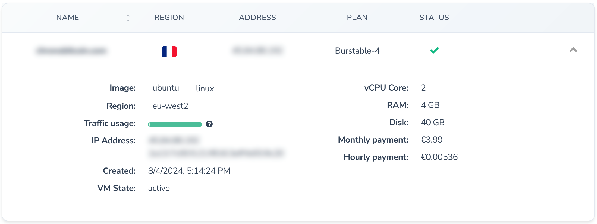
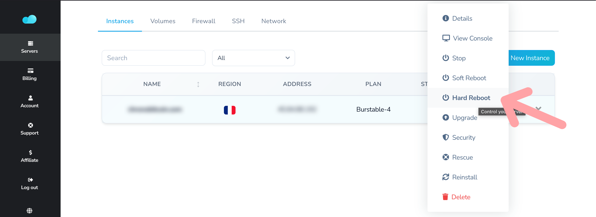
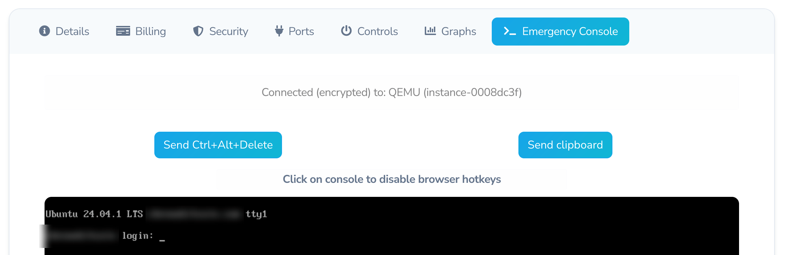

# 09 - Emergency Procedures

**Difficulty Level:** 🔴 Advanced  
**Risk Level:** 🔴 High - *Follow these procedures carefully during critical situations*

Step-by-step emergency response procedures for critical server issues, including complete outages, lockouts, data loss, and security incidents.

---

## 📋 Table of Contents

1. [When to Use This Guide](#when-to-use-this-guide)
2. [Emergency Contact Information](#emergency-contact-information)
3. [Server Completely Down](#server-completely-down)
4. [Locked Out of SSH](#locked-out-of-ssh)
5. [Data Corruption or Loss](#data-corruption-or-loss)
6. [Security Breach Response](#security-breach-response)
7. [When to Escalate](#when-to-escalate)
8. [Emergency Checklist](#emergency-checklist)

---

## When to Use This Guide

**Use these procedures when:**

- ❌ Server is completely unresponsive
- ❌ Cannot connect via SSH
- ❌ n8n shows corrupted or missing data
- ❌ Suspected unauthorized access
- ❌ All containers are down
- ❌ Website/services not responding

> ⚠️ **IMPORTANT:** Stay calm! Most issues can be resolved. Read the entire relevant section before taking action.

---

## Emergency Contact Information

### Before You Start

**Have this information ready:** (You can find all the information in the credential report)

```
Server Provider: [e.g., HostVDS...]
Server IP Address: XXX.XXX.XXX.XXX
Your Admin USERNAME: [Your USERNAME]

Provider Support:
- Email us: https://www.nocodenode.com/contact
- HostVDS (server provider) news channel : https://t.me/hostvds_news
- HostVDS community chat : https://t.me/hostvds_cloud
```

### When to Contact Your System Administrator

**Contact immediately if:**
- Server has been compromised/hacked
- Data loss cannot be recovered from backups
- Multiple emergency procedures have failed
- You're unsure about the next step in a critical situation

**Contact Information:**
```
Name: _______________
Email: _______________
Phone: _______________
Best hours to reach: _______________
```

---

## Server Completely Down

### Symptoms
- Cannot access n8n web interface
- Cannot connect via SSH
- All services unreachable
- Timeout errors when trying to connect

### Emergency Response Steps

#### Step 1: Verify the Problem

```bash
# From your local computer, test if server responds
ping YOUR_SERVER_IP

# Try to connect via SSH
ssh USERNAME@YOUR_SERVER_IP -p 1077 -i filepath/to/your/private/key
```

**Output examples:**

If server is down:
```
Request timeout for icmp_seq 0
Request timeout for icmp_seq 1
```

If server is up but SSH is down:
```
64 bytes from XXX.XXX.XXX.XXX: icmp_seq=0 ttl=54 time=45.2 ms
```

#### Step 2: Access Cloud Provider Console

1. **Log into your cloud provider's dashboard** (HostVDS)
2. **Navigate to your server/droplet/instance** (Select from the main page)
3. **Check server status** (open detail with the tiny arrow on the right)  

  

Look for the status in VM State.

#### Step 3: Check Provider Status Page

```
HostVDS : They don't have an official status page. 
DigitalOcean: https://status.digitalocean.com
AWS: https://status.aws.amazon.com
Hetzner: https://status.hetzner.com
```

> 💡 **TIP:** Sometimes the issue is with your provider, not your server!

#### Step 4: Attempt Remote Restart

**Via Cloud Console (HostVDS):**

1. Go to your main dashboard
2. Click "Actions" → "Hard Reboot"
3. Wait 2-3 minutes
4. Try connecting again  

  

```bash
# Test connection after restart
ssh USERNAME@YOUR_SERVER_IP -p 1077 -i filepath/to/your/private/key

# Once connected, check what happened
sudo journalctl -xe | tail -50
```

#### Step 5: Use Emergency Console

**If SSH still doesn't work after reboot:**

HostVDS offer a web-based console:  



1. In your provider's dashboard, Click "Actions" → "View Console"
2. Click to open web-based terminal
3. Login with your username and password (not SSH key!)
4. Check system status:

```bash
# Check if services are running
sudo systemctl status docker

# Check disk space
df -h

# Check memory
free -h

# View recent errors
sudo journalctl -p err -n 50
```

#### Step 6: Emergency Service Recovery

**If Docker isn't running:**

```bash
# Start Docker
sudo systemctl start docker

# Check status
sudo systemctl status docker
```

**If Docker is running but containers aren't:**

```bash
# Navigate to docker directory
cd ~/docker

# Start all containers
docker compose up -d

# Check status
docker compose ps
```

### Common Causes and Quick Fixes

| Problem | Cause | Quick Fix |
|---------|-------|-----------|
| Disk full (100%) | Logs grew too large | `sudo docker system prune -a` |
| Out of memory | Runaway process | Restart via console, then investigate |
| Network issue | Provider problem | Wait for provider to resolve |
| Kernel panic | System update issue | Reboot via cloud console |
| Power off | Accidental shutdown | Power on via cloud console |

---

## Locked Out of SSH

### Symptoms
- "Permission denied (publickey)" error
- "Connection refused" 
- Lost your SSH private key
- Changed SSH port but forgot what it was

### Emergency Response Steps

#### Step 1: Identify the Lock-Out Type

**Test your connection:**

```bash
ssh USERNAME@YOUR_SERVER_IP -p 1077 -i filepath/to/your/private/key
```

Look for these messages:

**"Connection refused":**
- SSH service isn't running
- → Use cloud console to fix

**"Permission denied (publickey)":**
- Key authentication problem
- → Need to recover or reset keys

**"Connection timed out":**
- Wrong IP or firewall issue
- → Check IP address and firewall rules

#### Step 2: Access Via Cloud Console

1. **Log into cloud provider dashboard**
2. **Open web-based console/terminal**
3. **Login with username + password** (not SSH key)

> ⚠️ **IMPORTANT:** If you never set a password, you may need to use your provider's password reset feature first!

#### Step 3: Check SSH Service Status

```bash
# Check if SSH is running
sudo systemctl status ssh

# If not running, start it
sudo systemctl start ssh

# Enable it to start on boot
sudo systemctl enable ssh
```

**Expected output when SSH is healthy:**
```
● ssh.service - OpenBSD Secure Shell server
     Loaded: loaded (/usr/lib/systemd/system/ssh.service; disabled; preset: enabled)
     Active: active (running) since Tue 2025-12-23 05:13:46 CET; 1 week 3 days ago
```

#### Step 4: Verify SSH Configuration

```bash
# Check SSH configuration
sudo nano /etc/ssh/sshd_config
```

**Verify these critical settings:**
```
Port 1077                       # Or your custom port
PermitRootLogin no              # Should be 'no'
PubkeyAuthentication yes        # Must be 'yes'
PasswordAuthentication no       # Should be 'no' (for security)
```

If you changed the port but forgot it:
```bash
# Find the SSH port
sudo grep "^Port" /etc/ssh/sshd_config
```

**Output:**
```
Port 1077
```

Then connect with:
```bash
ssh your-username@YOUR_SERVER_IP -p 1077 -i filepath/to/your/private/key
```

#### Step 5: Fix SSH Key Issues

**If your SSH key is rejected:**

```bash
# Check if your public key is in authorized_keys
cat ~/.ssh/authorized_keys

# If empty or missing your key, add it
nano ~/.ssh/authorized_keys
# Paste your public key (the one ending in .pub)
# Save and exit (Ctrl+X, Y, Enter)

# Set correct permissions
chmod 700 ~/.ssh
chmod 600 ~/.ssh/authorized_keys
```

> 💡 **TIP:** Your public key should look like:  
> `ssh-ed25519 AAAAB3NzaC1yc2EAAAADAQABAAAB...service@yourdomain.website`

#### Step 6: Restart SSH Service

```bash
# After making changes, restart SSH
sudo systemctl restart ssh

# Verify it's running
sudo systemctl status ssh
```

#### Step 7: Test Connection

**From your local computer:**

```bash
# Test SSH connection
ssh your-username@YOUR_SERVER_IP -p 1077 -i filepath/to/your/private/key
```

### Recovery Strategies

**If you lost your SSH private key:**

1. Access server via cloud console
2. Generate a new key pair on your local computer:
   ```bash
   ssh-keygen -t ed25519 -C "your-email@example.com"
   ```
3. Copy the new public key
4. Add it to `~/.ssh/authorized_keys` on the server (via console)
5. Test connection with new key

**If you accidentally locked yourself out:**

```bash
# Via cloud console, temporarily enable password auth
sudo nano /etc/ssh/sshd_config

# Change this line
PasswordAuthentication yes

# Restart SSH
sudo systemctl restart ssh

# Now you can login with password, then fix your keys
# DON'T FORGET to disable password auth again after fixing!
```

---

## Data Corruption or Loss

### Symptoms
- n8n workflows missing or corrupted
- Database errors
- "Cannot connect to database"
- Blank or error pages in n8n
- Files missing from expected locations

### Emergency Response Steps

#### Step 1: Assess the Damage

**Connect to your server:**

```bash
ssh your-username@YOUR_SERVER_IP -p 1077 -i filepath/to/your/private/key
cd ~/docker
```

**Check what's running:**

```bash
docker compose ps
```

**Look at recent logs:**

```bash
# Check n8n logs for errors
docker compose logs n8n --tail=100

# Check MySQL logs
docker compose logs db_core --tail=100
```

**Common error messages:**

```
ERROR: Connection to database failed
ERROR: Table 'n8n.workflow_entity' doesn't exist
ERROR: Disk quota exceeded
```

#### Step 2: Stop Services Immediately

> ⚠️ **IMPORTANT:** Stop services to prevent further corruption!

```bash
cd ~/docker
docker compose stop
```

**Expected output:**
```
[+] Stopping 4/4
 ✔ Container n8n       Stopped
 ✔ Container traefik   Stopped
 ✔ Container db_core   Stopped
 ✔ Container phpmy     Stopped
```

#### Step 3: Check Disk Space

```bash
df -h
```

**Output example:**
```
Filesystem      Size  Used   Avail Use% Mounted on
/dev/vda1        19G  18.9G   0.1G  99% /
```

If disk is nearly full (>95%):
```bash
# Free up space immediately
sudo docker system prune -af
sudo journalctl --vacuum-time=7d
```

#### Step 4: Verify Backup Availability

```bash
# List recent backups
ls -lh ~/docker/backups/ | tail -10

# Check backup size (should not be 0 bytes)
du -sh ~/docker/backups/*.tar.gz
```

**Expected output:**
```
4.0K	/home/USERNAME/docker/backups/docker-compose-20251230-051614.tar.gz
4.0K	/home/USERNAME/docker/backups/docker-compose-20251230-051934.tar.gz
7.5M	/home/USERNAME/docker/backups/mysql-20251230-051441.tar.gz
7.5M	/home/USERNAME/docker/backups/mysql-20251230-051934.tar.gz
360K	/home/USERNAME/docker/backups/n8n-20251230-051524.tar.gz
360K	/home/USERNAME/docker/backups/n8n-20251230-051934.tar.gz
24K	    /home/USERNAME/docker/backups/traefik-20251230-051535.tar.gz
24K	    /home/USERNAME/docker/backups/traefik-20251230-051934.tar.gz
```

> ⚠️ **IMPORTANT:** If all backups are 0 bytes or very small, contact your administrator immediately!

#### Step 5: Attempt Database Repair for n8n (if MySQL is selected has the database engine. default is SQLite) 

**Only if corruption is minor:**

```bash
# Start only MySQL
cd ~/docker
docker compose up -d db_core

# Wait 30 seconds, then access MySQL
docker compose exec db_core bash

# Inside container
mysql -u root -p
# Enter password when prompted

# Check databases
SHOW DATABASES;

# Select n8n database
USE n8n;

# Check tables
SHOW TABLES;

# Repair tables if needed
REPAIR TABLE workflow_entity;
REPAIR TABLE execution_entity;
```

**Expected output if successful:**
```
+---------------------------+--------+----------+----------+
| Table                     | Op     | Msg_type | Msg_text |
+---------------------------+--------+----------+----------+
| n8n.workflow_entity       | repair | status   | OK       |
+---------------------------+--------+----------+----------+
```

Exit MySQL:
```bash
exit
exit
```

#### Step 6: Restore from Backup

**If repair doesn't work, restore from backup:** (refer to 06-backup-recovery restore.sh script)  
> ⚠️ **WARNING:** The script is only applicable for docker volumes. Do not use it to restore docker files.  

```bash
# Stop all services
cd ~/docker
docker compose down

# Restore from most recent backup of the selected service you picked to restore.  

cd ~
./restore.sh backups/backup-YYYYMMDD-HHMMSS.tar.gz

# Follow the prompts
# This will restore your data and restart services
```

> 💡 **TIP:** If today's backup is corrupted, try yesterday's backup instead.

#### Step 7: Verify Recovery

```bash
# Check all services are running
docker compose ps

# Test n8n access
curl -I https://n8n.yourdomain.website

# Check n8n logs for errors
docker compose logs n8n --tail=50
```

**Visit your n8n URL and verify:**
- [ ] Can login
- [ ] Workflows are present
- [ ] Can execute a simple workflow
- [ ] Database connections work

### Prevention Checklist

After recovery, implement these safeguards:

```bash
# Enable automatic backups
crontab -e

# Add this line if not present:
0 2 * * * /home/USERNAME/backup.sh

# Test backup script
~/backup.sh

# Verify backup was created
ls -lh ~/backups/ | tail -1
```

---

## Security Breach Response

### Symptoms
- Unexpected login attempts in logs
- Unknown processes running
- Unfamiliar files in system directories
- Server sending spam or attacking other systems
- Unusual network traffic
- Changed passwords or SSH keys
- Cryptocurrency mining processes

### Emergency Response Steps

> ⚠️ **CRITICAL:** If you suspect a breach, act immediately but methodically!

#### Step 1: Document Everything

**Before changing anything, collect evidence:**

```bash
# Save current process list
ps aux > ~/breach-processes.txt

# Save network connections
sudo netstat -tulpn > ~/breach-network.txt

# Save recent logins
last -f /var/log/wtmp > ~/breach-logins.txt

# Save authentication logs
sudo tail -1000 /var/log/auth.log > ~/breach-auth.txt

# Save current cron jobs
crontab -l > ~/breach-cron.txt
sudo crontab -l > ~/breach-cron-root.txt

# Create a dated folder for evidence
mkdir ~/breach-evidence-$(date +%Y%m%d)
mv ~/breach-*.txt ~/breach-evidence-$(date +%Y%m%d)/
```

#### Step 2: Isolate the Server

**If breach is confirmed:**

```bash
# Block all new incoming connections (keeps existing SSH open)
sudo iptables -A INPUT -m state --state NEW -j DROP

# Or via cloud provider firewall
# Log into cloud console → Networking → Remove all firewall rules except your IP
```

> 💡 **TIP:** This prevents attacker from creating new connections while you investigate.

#### Step 3: Check for Suspicious Activity

**Look for cryptocurrency miners:**

```bash
# Check CPU usage by process
top -bn1 | head -20

# Look for suspicious processes
ps aux | grep -E "xmrig|minerd|cpuminer|nicehash"

# Check for hidden processes
ps aux | grep "\["
```

**Check for unauthorized users:**

```bash
# List all user accounts
cat /etc/passwd | grep /bin/bash

# You should only see YOUR username and root
# Any others are suspicious!
```

**Check for backdoors:**

```bash
# Check SSH authorized keys
cat ~/.ssh/authorized_keys
# Should only contain YOUR public keys

# Check root authorized keys
sudo cat /root/.ssh/authorized_keys
# Should be empty or only contain known keys

# Check for unusual SUID files
sudo find / -perm -4000 -type f 2>/dev/null > ~/suid-files.txt
```

**Check cron jobs for malicious tasks:**

```bash
# Check your cron jobs
crontab -l

# Check system cron jobs
sudo ls -la /etc/cron.*

# Check systemd timers
systemctl list-timers --all
```

#### Step 4: Secure Access Immediately

**Change all passwords:**

```bash
# Change your user password
passwd

# Generate a new, strong password (use a password manager!)
```

**Rotate SSH keys:**

```bash
# Backup old keys first
cp ~/.ssh/authorized_keys ~/.ssh/authorized_keys.backup

# On your LOCAL computer, generate new keys
ssh-keygen -t ed25519 -C "your-email@example.com"

# Add new key to server (from LOCAL computer)
ssh-copy-id -i ~/.ssh/id_ed25519.pub your-username@YOUR_SERVER_IP

# On server, verify new key is present
cat ~/.ssh/authorized_keys

# Remove old keys
nano ~/.ssh/authorized_keys
# Delete any unfamiliar keys
```

**Change n8n credentials:**

```bash
# Change n8n admin password via the web interface
# Navigate to: Settings → Users → Change Password
```

**Change database password:**

```bash
cd ~/docker
nano .env

# Update these variables with new, strong passwords
MYSQL_ROOT_PASSWORD=new_strong_password_here
MYSQL_PASSWORD=new_strong_password_here

# Restart MySQL with new password
docker compose up -d mysql
```

#### Step 5: Kill Suspicious Processes

```bash
# If you found suspicious processes
sudo kill -9 PROCESS_ID

# Remove suspicious cron jobs
crontab -e
# Delete any unfamiliar lines

# Check and remove systemd timers
systemctl list-timers
sudo systemctl disable suspicious-timer.timer
sudo systemctl stop suspicious-timer.timer
```

#### Step 6: Check Docker Containers

```bash
# List all containers (even stopped ones)
docker ps -a

# Check for unfamiliar containers
# Look for names you don't recognize

# Remove suspicious containers
docker rm -f suspicious_container_name

# Check Docker networks
docker network ls

# Check for crypto mining images
docker images | grep -E "xmrig|miner"
```

#### Step 7: Review Logs for Entry Point

```bash
# Check authentication logs for successful logins
sudo grep "Accepted" /var/log/auth.log | tail -50

# Look for failed login attempts
sudo grep "Failed password" /var/log/auth.log | tail -50

# Check for SSH brute force attempts
sudo grep "authentication failure" /var/log/auth.log | wc -l
```

**Common entry points:**
- Weak passwords
- Exposed SSH with password auth enabled
- Outdated software with known vulnerabilities
- Stolen SSH keys
- Compromised WordPress or other web apps

#### Step 8: System Hardening

**Disable password authentication (if not already):**

```bash
sudo nano /etc/ssh/sshd_config

# Ensure these settings
PasswordAuthentication no
PermitRootLogin no
PubkeyAuthentication yes

# Restart SSH
sudo systemctl restart ssh
```

**Enable fail2ban:**

```bash
# Install fail2ban
sudo apt update
sudo apt install fail2ban -y

# Start and enable
sudo systemctl start fail2ban
sudo systemctl enable fail2ban

# Check status
sudo fail2ban-client status sshd
```

**Update everything:**

```bash
# Update OS
sudo apt update && sudo apt upgrade -y

# Update Docker images
cd ~/docker
docker compose pull
docker compose up -d
```

#### Step 9: Contact Your Administrator

**Prepare this information:**

- Timeline of when you noticed the issue
- Copy of evidence files from Step 1
- List of suspicious processes/files you found
- Any unusual network traffic patterns
- Recent changes made to the system

> ⚠️ **IMPORTANT:** DO NOT restore from backups until determining the breach entry point, or you'll restore the vulnerability!

### Post-Incident Checklist

After the immediate crisis:

- [ ] Review all logs thoroughly
- [ ] Check all backups for signs of compromise
- [ ] Update all software to latest versions
- [ ] Implement fail2ban and stricter firewall rules (Should be done already)
- [ ] Review and strengthen all passwords
- [ ] Enable two-factor authentication where possible
- [ ] Document what happened and how it was resolved
- [ ] Set up better monitoring and alerting
- [ ] Consider cloud provider security scanning tools

---

## When to Escalate

### Immediate Escalation Required

**Contact your administrator immediately if:**

- 🚨 Confirmed security breach with active attacker
- 🚨 Data loss that cannot be recovered from backups
- 🚨 Multiple backups are corrupted or missing
- 🚨 Server is sending spam or attacking other systems
- 🚨 Cloud provider has suspended your account
- 🚨 You accidentally deleted critical system files
- 🚨 Database completely unrecoverable
- 🚨 All emergency procedures have failed

### Information to Provide

When escalating, have ready:

```
1. What went wrong:
   - Detailed description of the problem
   - When it started
   - What you were doing when it happened

2. What you've tried:
   - Steps you've already taken
   - Results of those steps
   - Error messages received

3. Current system state:
   - Are services running?
   - Can you access the server?
   - What's working and what's not?

4. Impact assessment:
   - Are workflows currently blocked?
   - Is data at risk?
   - Are users affected?

5. Evidence files:
   - Saved logs
   - Screenshots of errors
   - Output from diagnostic commands
```

### Non-Urgent Escalation

**Contact your administrator within 24 hours if:**

- ⚠️ Suspicious activity detected but contained
- ⚠️ Performance issues persist after troubleshooting
- ⚠️ Backups consistently failing
- ⚠️ Unusual but not critical error messages
- ⚠️ Need help planning major changes
- ⚠️ Questions about security best practices

---

## Emergency Checklist

### Quick Decision Tree

```
Is the server responding at all?
├─ NO → [Server Completely Down](#server-completely-down)
└─ YES → Can you SSH into it?
    ├─ NO → [Locked Out of SSH](#locked-out-of-ssh)
    └─ YES → What's the issue?
        ├─ Missing/corrupted data → [Data Corruption or Loss](#data-corruption-or-loss)
        ├─ Suspicious activity → [Security Breach Response](#security-breach-response)
        └─ Other issue → Check [07 - Monitoring & Maintenance](07-monitoring-maintenance.md)
```

### Emergency Command Reference

```bash
# Check if server is alive
ping YOUR_SERVER_IP

# Force restart all containers
cd ~/docker && docker compose restart

# Check what's using resources
top
df -h
free -h

# View recent errors
sudo journalctl -p err -n 50
docker compose logs --tail=100

# Nuclear option: restart everything
sudo reboot
```

### Keep Calm Reminders

> 💡 Remember:
> - Most issues can be fixed
> - You have backups
> - Your administrator is available
> - Document before changing
> - One step at a time

---

## Navigation

**Previous Guide:** [08 - Updates & Upgrades](08-updates-upgrades.md)  
**Next Guide:** [10 - Best Practices & Tips](10-best-practices.md)  
**Back to:** [Documentation Home](README.md)

---

*Last Updated: 02/01/2026*